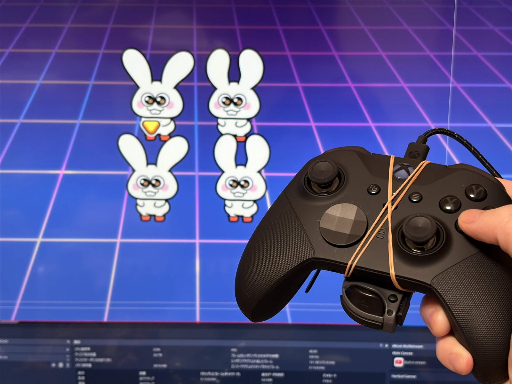
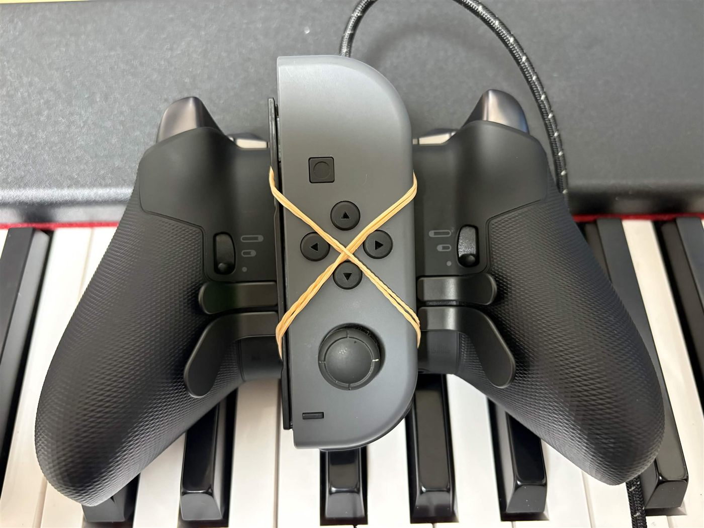
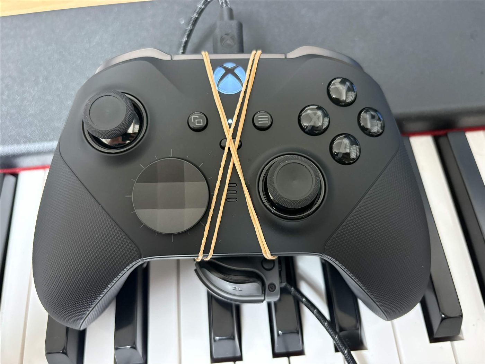

# NinBuddy — with real HD rumble

<p align="center">
  
</p>

Play your Nintendo Switch with an **Xbox or PlayStation controller** (or your
phone's browser) through a Raspberry Pi — and feel the game's **real HD
rumble** through a physical Joy-Con, all on the Pi's single onboard
Bluetooth adapter.

This is a maintained continuation of
[jotslo/ninbuddy](https://github.com/jotslo/ninbuddy) (now archived), built
on [Brikwerk/nxbt](https://github.com/Brikwerk/nxbt). Along the way it fixed
the NXBT protocol bug that prevented **every** emulated controller from
receiving game rumble — see
[Brikwerk/nxbt#198](https://github.com/Brikwerk/nxbt/issues/198) /
[PR #199](https://github.com/Brikwerk/nxbt/pull/199).

## What you get

- Xbox / PlayStation controller → Switch, no PC or internet needed
- Phone browser as a controller (built-in web UI)
- **Game HD rumble forwarded to a real Joy-Con** you hold or set on your
  controller — actual LRA haptics, not an ERM approximation
- Xbox Elite rear paddles mapped to buttons
- Reconnects to your console directly after the first pairing — no more
  Change Grip/Order screen on every start
- Survives USB blips: a flaky cable pauses input for a moment instead of
  destroying the session

## Requirements

- Raspberry Pi with built-in Bluetooth (developed on a Pi 5), Python 3.9+
- A USB game controller (Xbox Series / Elite 2 / PS4 tested)
- Optional, for rumble: a spare Joy-Con (L or R)

## Install

```bash
sudo apt install python3-venv python3-dev libdbus-1-dev
python3 -m venv ~/ninbuddy-venv
~/ninbuddy-venv/bin/pip install pygame flask flask-socketio
# NXBT with the rumble fixes (until merged upstream):
~/ninbuddy-venv/bin/pip install git+https://github.com/satomasahiro2005/nxbt.git@rumble-passthrough
git clone https://github.com/satomasahiro2005/ninbuddy-rumble.git ~/ninbuddy
```

Run with `sudo ~/ninbuddy-venv/bin/python ~/ninbuddy/src/server.py`, or as a
systemd service:

```ini
# /etc/systemd/system/ninbuddy.service
[Unit]
Description=NinBuddy Switch controller bridge
After=bluetooth.service
[Service]
ExecStartPre=/bin/sh -c 'bluetoothctl power on || true'
ExecStart=/home/pi/ninbuddy-venv/bin/python /home/pi/ninbuddy/src/server.py
Restart=on-failure
[Install]
WantedBy=multi-user.target
```

NXBT needs to own the adapter, so the stock input plugin must not grab it —
NXBT's docs cover running `bluetoothd` with `--noplugin=input` /
`--compat`.

## Usage

1. Plug in your USB controller.
2. On the Switch, open **Change Grip/Order**. The virtual Pro Controller
   pairs and you can play. (From the second start onwards NinBuddy dials
   the console directly and this screen is not needed.)
3. On Wi-Fi, the terminal prints a URL — open it on your phone to use the
   touch controller.

### Rumble through a real Joy-Con

1. Tell NinBuddy which Joy-Con is yours (once):

   ```bash
   sudo mkdir -p /etc/nxbt
   echo "XX:XX:XX:XX:XX:XX" | sudo tee /etc/nxbt/joycon_mac
   ```

   (Find the MAC with `sudo hcitool scan` while holding the Joy-Con's SYNC
   button.)
2. Once you're connected to the console, open a pairing window and sync
   the Joy-Con (NinBuddy only pages the Joy-Con on request, because paging
   a sleeping one disturbs the Switch link):

   ```bash
   touch /tmp/nxbt_joycon_connect   # 90 s window
   ```

   then hold the Joy-Con's SYNC button until the lights sweep — NinBuddy
   grabs it within a few seconds and enables its motor.
3. Strap the Joy-Con to the back of your controller with **two rubber
   bands crossed in an X**, pulled tight — the Joy-Con has to stay pressed
   hard against the shell the whole time, or the vibration energy never
   transfers into your hands. It nestles between the grips, and the bands
   pass between the sticks and buttons so nothing on the front is blocked:

   <p>
     
     
   </p>

4. Play. The console's HD rumble frames are forwarded raw over L2CAP, and
   you feel them through the Joy-Con's actuator in your hands.

The same trigger works any time the Joy-Con drops off (battery, sleep):
touch the file, hold SYNC, keep playing.

### Xbox Elite rear paddles

The four rear paddles (exposed by the Linux `xpad` driver as
`BTN_TRIGGER_HAPPY5-8`) default to B / A / DPAD_UP / DPAD_DOWN. Remap them
in `/etc/ninbuddy/paddle_map`:

```ini
P1=B
P2=A
P3=ZL
P4=NONE
```

Values are Switch button names (`A B X Y L R ZL ZR DPAD_* PLUS MINUS HOME`),
`L_STICK_PRESSED` / `R_STICK_PRESSED`, or `NONE` to disable a paddle. The
file is re-read whenever the controller (re)connects.

### Runtime knobs

| File | Meaning |
|---|---|
| `/etc/nxbt/joycon_mac` | MAC of the rumble Joy-Con (absent = rumble off) |
| `/etc/ninbuddy/paddle_map` | Elite paddle assignment (see above) |
| `/tmp/nxbt_joycon_connect` | touch to open a 90 s Joy-Con paging window |
| `/tmp/nxbt_joycon_off` | exists = never page the Joy-Con |
| `/tmp/nxbt_input_rate` | input report resend cadence in ticks (default 1 = ~66 Hz, like real hardware) |
| `/etc/nxbt/last_switch` | remembered console address (written automatically) |

## How the rumble works (short version)

The console gates application rumble on a correct reply to the Enable
Vibration subcommand (`0x48`): stock NXBT answered with a malformed ACK, so
system sounds rumbled but games never did (one byte, `0x82`→`0x80`,
[#198](https://github.com/Brikwerk/nxbt/issues/198)). With that fixed, the
console streams HD rumble to the virtual Pro Controller; NinBuddy remaps
the dual-motor frames for the Joy-Con's single motor and writes them to its
interrupt channel with the HIDP header and the motor-enable handshake a
real Joy-Con expects. Full protocol notes live in
[`joycon-rumble/NOTES.md`](joycon-rumble/NOTES.md).

## Credits

- [jotslo](https://github.com/jotslo) — the original NinBuddy
- [Brikwerk](https://github.com/brikwerk) — NXBT
- [dekuNukem](https://github.com/dekuNukem/Nintendo_Switch_Reverse_Engineering)
  — Switch controller protocol reverse engineering

## License

MIT — see [LICENSE](LICENSE). Original NinBuddy © jotslo.
